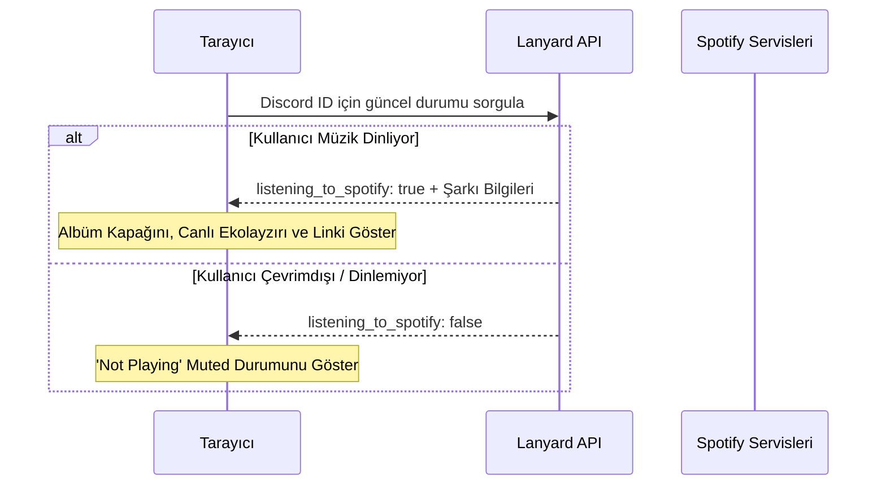

# 🌌 devAgnes Portfolyo — Premium Next.js, TypeScript & Glassmorphism Vitrini

<div align="center">
  
  [](https://nextjs.org/)
  [](https://react.dev/)
  [](https://www.typescriptlang.org/)
  [](#tasarım-sistemi-ve-estetik)
  [](https://opensource.org/licenses/MIT)

  <p align="center">
    Ziyaretçileri ilk bakışta büyülemek için tasarlanmış, üst düzey bir yazılım geliştirici portfolyosu. <b>Next.js 16</b>, <b>React 19</b> ve <b>TypeScript</b> üzerine inşa edilen bu proje; derin karanlık tema, asil glassmorphism detayları, dinamik uluslararasılaştırma (i18n) ve gerçek zamanlı entegrasyonlar sunar.
  </p>

  <h4>
    <a href="#✨-Öne-çıkan-Özellikler">Özellikler</a> · 
    <a href="#🎨-tasarım-sistemi-ve-estetik">Estetik</a> · 
    <a href="#⚙️-kurulum-ve-yapılandırma">Kurulum</a> · 
    <a href="#📂-proje-mimarisi">Mimari</a> · 
    <a href="#🎵-spotify-lanyard-entegrasyonu">Spotify Entegrasyonu</a>
  </h4>
</div>

---

> [!NOTE]
> Bu portfolyo; yüksek performans, kusursuz kod düzeni ve üstün görsel "wow" faktörü için özel olarak optimize edilmiştir. Hazır veya jenerik temalar yerine, en ufak mikro animasyona kadar el yapımı CSS kuralları kullanılmıştır.

---

## ✨ Öne Çıkan Özellikler

- **🌐 Dinamik Çoklu Dil Desteği (i18n):** Next.js `[lang]` yönlendirme desenini kullanan dinamik dil yapısı. Türkçe (`tr.json`) ve İngilizce (`us.json`) dil dosyaları arasında sayfayı yeniden yüklemeden anında geçiş yapın.
- **🎵 Gerçek Zamanlı Spotify Widget:** **Lanyard API** ile entegre çalışarak anlık olarak dinlediğiniz şarkıyı gösterir. Dinamik SVG ses ekolayzırı, gerçek zamanlı parça detayları ve 10 saniyede bir otomatik veri yenileme içerir.
- **💎 Glassmorphism Arayüzü & Parıltılar:** Yarı saydam arka plan panelleri (`backdrop-filter: blur(10px)`), ince sınır parıltıları ve arka planda yavaşça titreşen neon gradyan dalgaları.
- **⚡ Gelişmiş Modern Altyapı:** Yıldırım hızında sayfa geçişleri ve yüklenme süreleri için en yeni **Next.js 16** App Router ve **React 19** asenkron işleyiş mekanizması.
- **🛠️ Etkileşimli Yetenek Göstergesi:** Geliştiricinin teknik seviyesini Ön Uç, Arka Uç, Veritabanı ve Araçlar kategorilerine ayırarak şık yüzde çubuklarıyla görselleştiren modern grid sistemi.
- **✉️ Şık Cam Efektli İletişim Formu:** Yüksek kaliteli giriş alanları, odaklanma efektleri ve yumuşak animasyonlu butonlar içeren premium iletişim formu.

---

## 🎨 Tasarım Sistemi ve Estetik

Tasarım dili, ziyaretçiye profesyonel ve son teknoloji bir hissiyat sunmak adına siber-karanlık bir palet ve modern tipografi üzerine kurulmuştur:

```ini
Arka Plan Rengi        = #020203  (Derin Uzay Siyahı)
Yüzey Katmanı          = #0a0a0c  (Mat Asfalt Grisi)
Yüzey Üzerine Gelme    = #121216  (Canlı Siber Gri)
Birincil Vurgu Rengi   = #6366f1  (Elektrik İndigo)
Vurgu Parıltısı        = rgba(99, 102, 241, 0.3)
Ana Yazı Tipi          = 'Outfit', sans-serif  (Geometrik ve Yumuşak)
Mono Yazı Tipi         = 'JetBrains Mono', monospace  (Temiz Teknik Mono)
```

### Mikro Animasyonlar
- **Yüzme Etkisi:** CSS `translateY` mantığı ile aralıksız yukarı-aşağı salınan elemanlar (`float-element`).
- **Cam Işıltılı Butonlar:** Fare imleciyle üzerine gelindiğinde buton içinde soldan sağa kayan parlak ışık efekti.
- **Dinamik Arka Plan:** Derinlik algısı yaratmak için arka planda yavaşça büyüyüp küçülen radyal ışık.

---

## 🎵 Spotify Lanyard Entegrasyonu

Uygulama, Discord hesabınız üzerinden Spotify'da ne dinlediğinizi canlı olarak çekmek için **Lanyard API** kullanır.



### Yapılandırma
Lanyard entegrasyonu varsayılan olarak Discord ID'nizi dinler. Bunu `.env` dosyanızda veya `src/lib/settings.ts` içinde kolayca özelleştirebilirsiniz:
```env
NEXT_PUBLIC_DISCORD_ID=discord_id_niz
NEXT_PUBLIC_BRANDING_NAME=devAgnes
NEXT_PUBLIC_BRANDING_SUFFIX=.co
NEXT_PUBLIC_ACCENT_COLOR=#6366f1
```

---

## 📂 Proje Mimarisi

```
devPortfolio/
├── src/
│   ├── app/
│   │   ├── [lang]/              # Dile göre yönlendirilen alt sayfalar
│   │   ├── api/                 # API yönlendirme işleyicileri
│   │   ├── dictionaries.ts      # Dil sözlüğü yükleyici yardımcı kodu
│   │   ├── globals.css          # Genel tasarım sistemi kuralları ve animasyonlar
│   │   └── page.module.css
│   ├── components/              # Yeniden kullanılabilir modüler arayüz bileşenleri
│   │   ├── Navbar.tsx           # Cam efektli yüzen navigasyon çubuğu
│   │   ├── Hero.tsx             # Etkileşimli karşılama ekranı
│   │   ├── About.tsx            # Biyografi ve hakkımda alanı
│   │   ├── Skills.tsx           # Teknik beceri seviye çubukları
│   │   ├── Projects.tsx         # Modern ürün ve proje kartları ızgarası
│   │   ├── SpotifyWidget.tsx    # Canlı müzik dinleme durumu kartı
│   │   └── LanguageSelector.tsx # Türkçe/İngilizce dil değiştirme butonu
│   ├── dictionaries/            # Çeviri JSON dosyaları
│   │   ├── us.json              # İngilizce metin içerikleri
│   │   └── tr.json              # Türkçe metin içerikleri
│   ├── lib/
│   │   └── settings.ts          # Merkezi yapılandırma ayarları
│   └── middleware.ts            # Dinamik dil yönlendirmesini yakalayan middleware
├── public/                      # Statik varlıklar ve SVG görselleri
├── tsconfig.json                # TypeScript yapılandırması
├── next.config.ts               # Next.js yapılandırması
└── package.json                 # Bağımlılıklar ve npm betikleri
```

---

## ⚙️ Kurulum ve Yapılandırma

> [!IMPORTANT]
> Projenin sorunsuz çalışması için sisteminizde en az **Node.js v18+** sürümünün yüklü olduğundan emin olun.

### 1. Depoyu Klonlayın
```bash
git clone https://github.com/kullanici-adiniz/devPortfolio.git
cd devPortfolio
```

### 2. Ortam Değişkenlerini Ayarlayın
Projenin kök dizininde `.env` veya `.env.local` dosyası oluşturun ve aşağıdaki değişkenleri tanımlayın:
```bash
NEXT_PUBLIC_BRANDING_NAME="devAgnes"
NEXT_PUBLIC_BRANDING_SUFFIX=".co"
NEXT_PUBLIC_ACCENT_COLOR="#6366f1"
NEXT_PUBLIC_DISCORD_ID="DISCORD_ID_NIZ"
```

### 3. Bağımlılıkları Yükleyin
```bash
npm install
```

### 4. Geliştirme Sunucusunu Başlatın
```bash
npm run dev
```
Uygulamayı görüntülemek için tarayıcınızda [http://localhost:3000](http://localhost:3000) adresine gidin!

### 5. Canlıya Alım İçin Derleme (Production Build)
```bash
npm run build
npm run start
```

---

## 🤝 Katkıda Bulunma

Her türlü katkıya, hata bildirimine ve yeni özellik taleplerine açığız! İstediğiniz zaman [issues sayfasından](https://github.com/kullanici-adiniz/devPortfolio/issues) sorun bildirebilir veya katkı sunabilirsiniz.

---

## 📝 Lisans

Bu proje **Apache License 2.0 Lisansı** ile dağıtılmaktadır. Daha fazla bilgi için `LICENSE` dosyasına göz atabilirsiniz.

<div align="center">
  <sub><a href="https://github.com/kullanici-adiniz">devAgnes</a> tarafından sevgiyle tasarlandı ve kodlandı.</sub>
</div>
